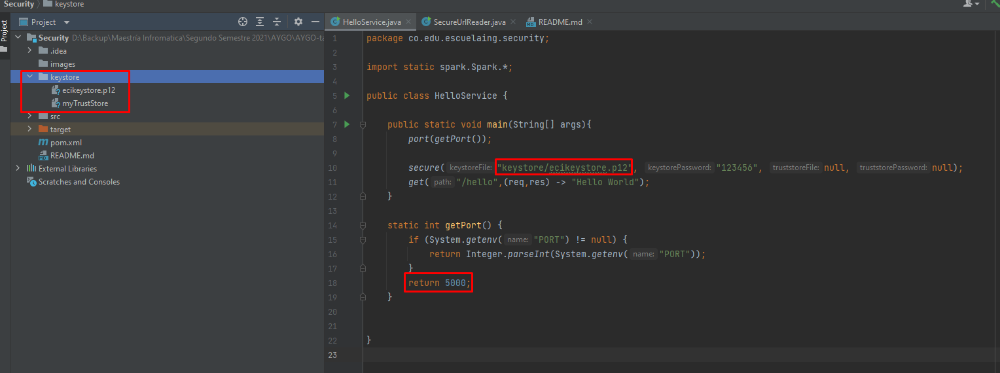
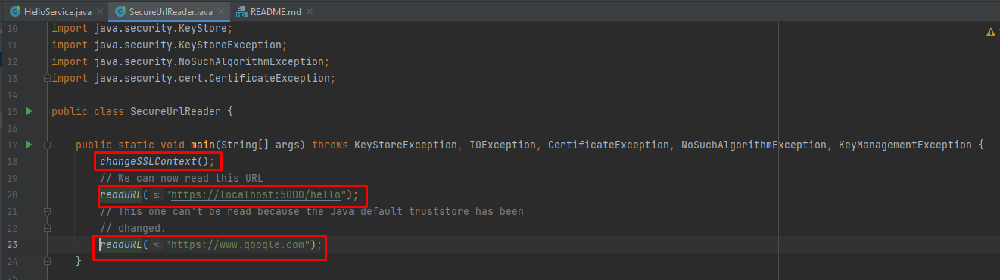
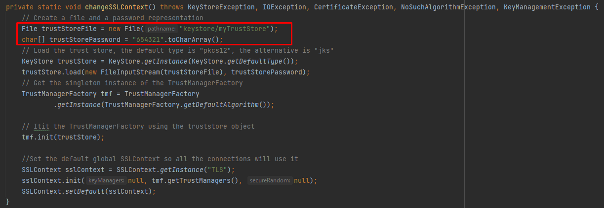
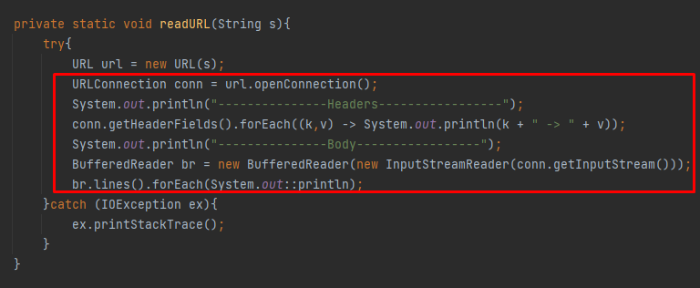
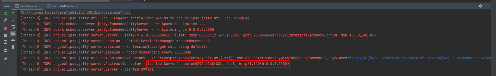
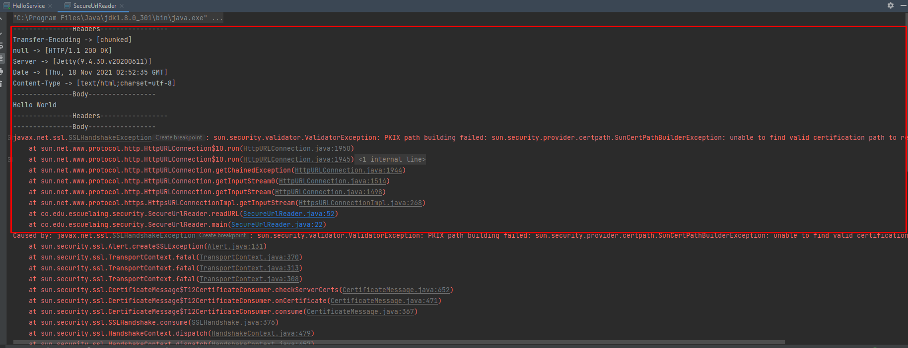
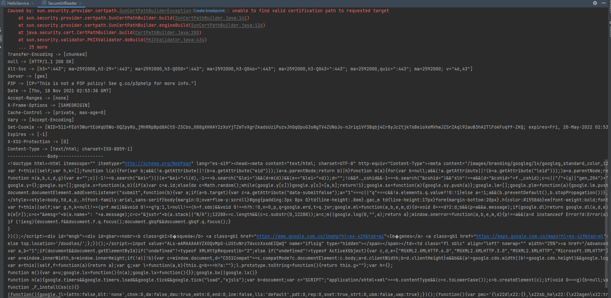

# AYGO-taller3 Parte 1

GERMAN ANDRES LOPEZ PACHECO

1. Este es el código del servicio "HelloWorld" que se va a ejecutar por el puerto 5000, configurado con los 
   archivos ecikeystore.c12 y myTrusStore.

2. La clase que va a leer 2 urls, la primera del servicio "HelloWorld" y la segunda a la dirección de Google, 
   luego está el método changeSSLContext() para acceder de forma segura al servidor "HelloWorld".

3. El método changeSSLContext(), con el cual se autentica para poder acceder al servidor "HelloWorld", con su 
    respectivo password del archivo myTrueStore

4. El método encargado de leer urls y obtener su encabezado y contenido (body).

5. El servidor "HelloWorld" corriendo por el puerto 5000.

6. Podemos ver el encabezado y el contenido del servidor "HelloWorld", porque previamente se autentico, pero en el caso
   de Google, no tenemos sus archivos de seguridad y menos su contraseña, por lo tanto va a fallar.

7. Pero si ejecutamos el código sin el método changeSSLContext(), va a pasar lo contrario, podemos ver el encabezado y el
   contenido de Google, pero como no estamos autenticados para el servidor "HelloWorld", por lo tanto va a fallar.

